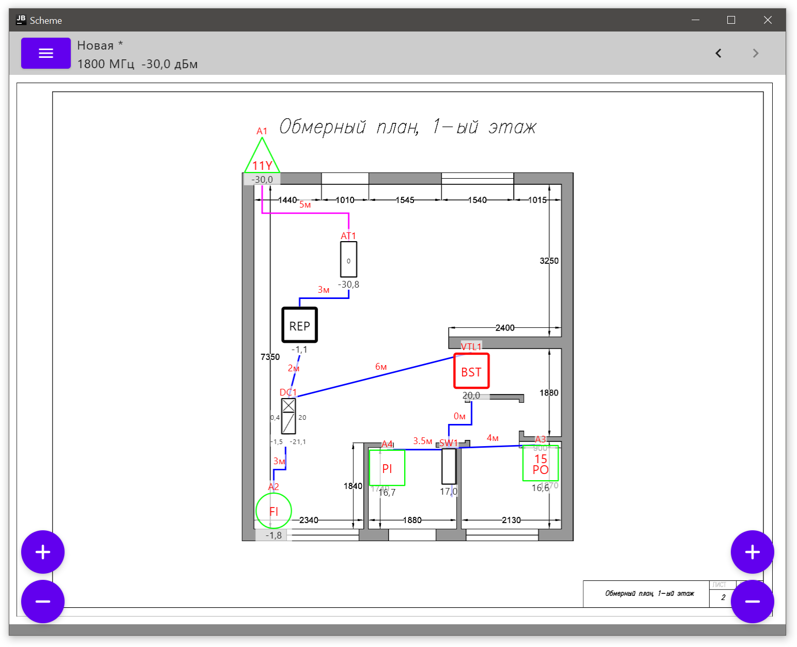
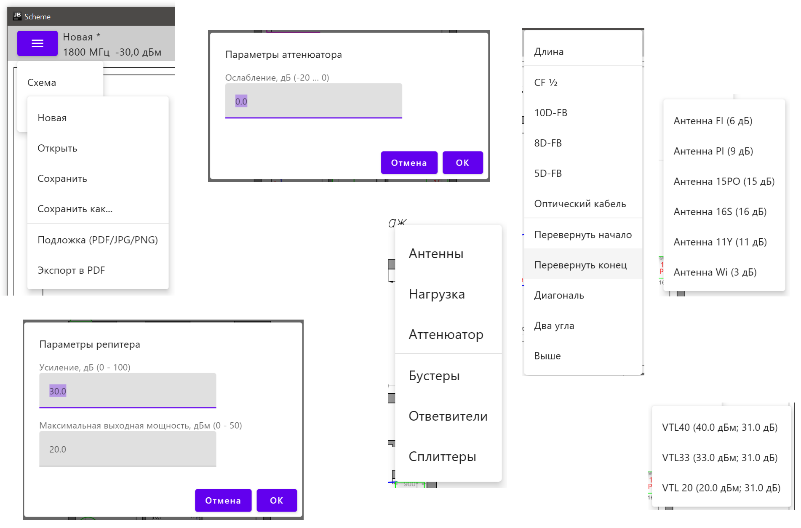
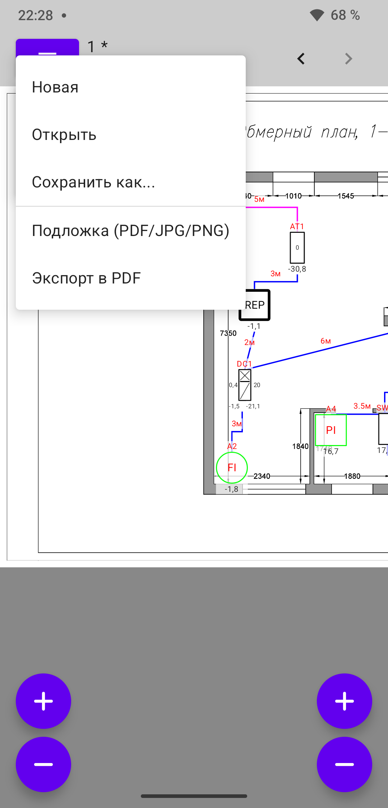

## Описание приложения

**Scheme** - это кроссплатформенное приложение для проектирования и расчета схем радиосистем,
разработанное на Kotlin Multiplatform с использованием Jetpack Compose.

### Основные возможности

- **Конструктор схем**: Интуитивно понятный интерфейс для создания схем радиосистем
- **Расчет сигналов**: Автоматический расчет уровней сигналов в различных точках схемы
- **Элементы схемы**: Поддержка различных компонентов:
  - Антенны (различных типов)
  - Кабели (с учетом затухания)
  - Разветвители (сплиттеры)
  - Комбайнеры
  - Повторители (репитеры)
  - Нагрузки

### Технические характеристики

- **Платформы**: Android, Desktop (Windows, macOS, Linux)
- **Архитектура**: Kotlin Multiplatform
- **UI Framework**: Jetpack Compose Multiplatform
- **Язык**: Kotlin

### Структура проекта

- `composeApp/commonMain` - общий код для всех платформ
- `composeApp/androidMain` - специфичный код для Android
- `composeApp/desktopMain` - специфичный код для Desktop

## Скриншоты приложения

### Desktop

### Конструктор схем

### Android

### Кабели

